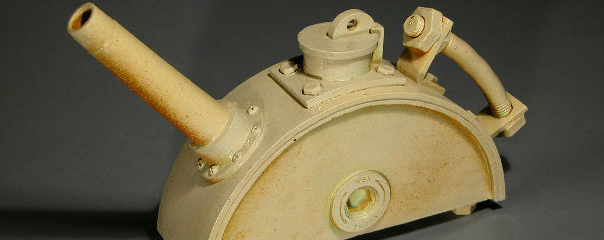
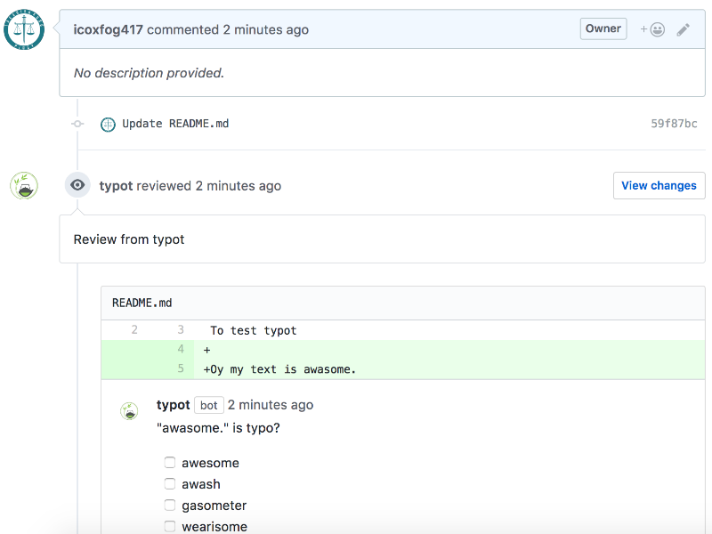
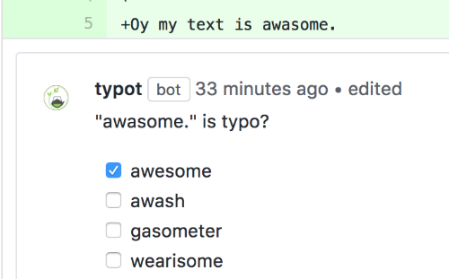
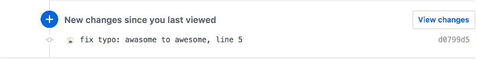
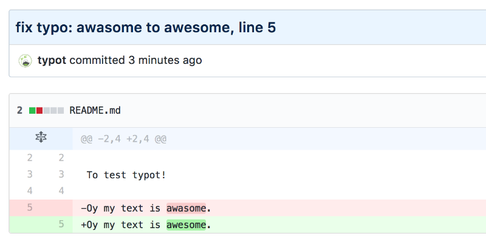

# typot

*photo from [independentman](https://flic.kr/p/2mHSE)*

Now release humans from checking the typos.  
The typot detects & fix typos in your pull request!

## Install

**[Please Authorize typot from this Link!](https://github.com/apps/typot)**

## How typot works

typot automatically check typos in your pull request.

The checked results are registered as review comments.  
If you want to adopt it, please check the one from the candidates.

After your checking, typot execute the fix automatically.

So you don't need to check & fix typo yourself!  
At the same time, your reviewer does not need to point out these.  
It will suppresses boring code review that start from typos check!
