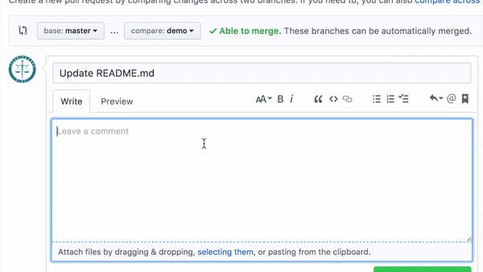

# typot

**typot** detects the typos in your pull request, and fix it by just selecting the modification candidates.

1. When you open the pull request, *typot* checks it and if there are typos, make review comments on it.
2. If suitable fix is in suggested candidates, then select it! *typot* adopts it automatically. 

## Install

**[Please Authorize typot from this Link!](https://github.com/apps/typot)**

## Dependencies

* [hug](http://www.hug.rest/)
* [PyEnchant](http://pythonhosted.org/pyenchant/)
* [unidiff](https://github.com/matiasb/python-unidiff)
* [PyJWT](https://github.com/jpadilla/pyjwt)

*icon's photo from [independentman](https://flic.kr/p/2mHSE)*
